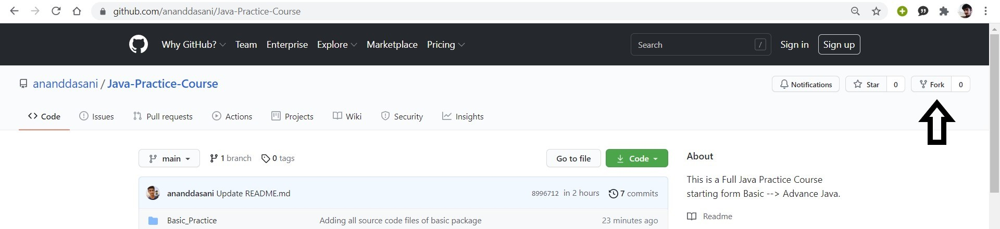
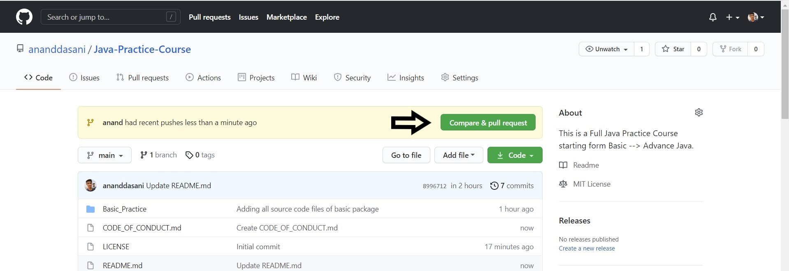
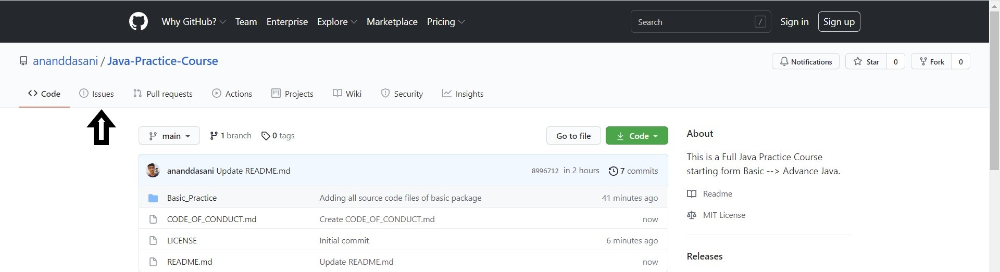

# Contributing Guidelines

### Learn how to create issues, Fork a repo, makes changes, and ask the maintainers to review and merge it

## Creating Pull Request

You have a GitHub repo and can push to it. All is well. But how the heck do you contribute to other people's GitHub projects? That is what I wanted to know after I learned git and GitHub. I will explain how to fork a git repo, make changes, and submit a pull request.

### Step 1: Fork the repository

- When you want to work on another's GitHub project, the first step is to fork a repo.<br>
  <br>

- Once there click on the Fork button in the top-right corner. This creates a new copy of the repo under your Github user account.

### Step 2: Clone the repository:

- Clone this Github repo. Open up the GitBash/Command Line and type in:<br>
  <br>
  
```git
$ git clone https://github.com/ananddasani/Java-Practice-Course.git
```
Don't forget to write your GitHub user name in place of _YOUR_USERNAME_

### Step 3: Create a development branch

- `cd` into the parent directory. Now create a branch of the master by pushing the command <br>
  <br>

```git
$ git checkout -b <YOUR-USERNAME>
```

- You can now check the branches by pushing in the command: git branch. You will see the Master Branch and another branch with your username.


- Start Coding 👩‍💻👨‍💻. Make apt commits with proper commit messages. Always use git status to see that you have not made changes on the file you were supposed not to.

- Add all the changes with this command: (`git add .`). This will add the changes to your present workspace. <br>
  <br>

  ```git
  $ git add <FILE_NAME>
  ```
To stage all the changed files, type in:

  ```git
  $ git add --all  or  $ git add .
  ```
This command snapshots the file in preparation for versioning and further adds it to the staging area.

- Make a commit. This will save a snapshot of your Project.<br>
  <br>

  ```git
  $ git commit -m "Your Message"
  ```
  
### Step 4: Push your changes

- Upload all local branch commits to the remote repository.
- Push the changes: git push <br>
  <br>

  ```git
  $ git push origin <branch_name>
  ```

### Step 5: Creating a Pull Request

- Once you push the changes to your repo, Go to your forked repository, the Compare & pull request button will appear in GitHub.<br>
  <br>

- Click it and you'll be taken to this screen.<br>
  <br>
  - Open a pull request by clicking the Create pull request button. This allows the repo's maintainers to reviews your work. From here, they can merge it if it is good, or they may ask you for some changes.<br>

## Creating an issue

Issues can be used to keep track of bugs, enhancements, or other requests.

- On GitHub, navigate to the main page of the repository.
- Under your repository name, click on the Issues button.
  <br>

- Click New issue.
  <br>
  - After creating the issue you have to wait until the project maintainer assigns the issue to you.
  - when you're finished, click Submit new issue.
    <br>
